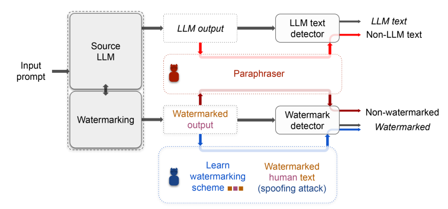

# Can AI-Generated Text be Reliably Detected?
### Paper: https://arxiv.org/abs/2303.11156

This repository contains codes for reproducing our results on paraphrasing attacks, impossibility results, and spoofing attacks. Please see requirements.txt for Python libraries that are needed. To reproduce our attacks on text watermarks, clone the repository from https://github.com/jwkirchenbauer/lm-watermarking.git to this folder. Clone https://github.com/martiansideofthemoon/ai-detection-paraphrases/ to perform experiments using DIPPER paraphraser.

rephrase/ contains the paraphrasing attacks. 
impossibilty/ contains codes for visualizing our theoretical results. 
pair-distribution/ contains codes for spoofing atttacks. 

====================================================================

COPYRIGHT AND PERMISSION NOTICE  
UMD Software [Can AI-Generated Text be Reliably Detected?] Copyright (C) 2022 University of Maryland 
All rights reserved. 
The University of Maryland (“UMD”) and the developers of [Can AI-Generated Text be Reliably Detected?] software (“Software”) give recipient (“Recipient”) permission to download a single copy of the Software in source code form and use by university, non-profit, or research institution users only, provided that the following conditions are met: 
1)	Recipient may use the Software for any purpose, EXCEPT for commercial benefit. 
2)	Recipient will not copy the Software. 
3)	Recipient will not sell the Software. 
4)	Recipient will not give the Software to any third party. 
5)	Any party desiring a license to use the Software for commercial purposes shall contact: 
UM Ventures, College Park at UMD at otc@umd.edu.

THIS SOFTWARE IS PROVIDED BY THE COPYRIGHT HOLDERS, CONTRIBUTORS, AND THE UNIVERSITY OF MARYLAND "AS IS" AND ANY EXPRESS OR IMPLIED WARRANTIES, INCLUDING, BUT NOT LIMITED TO, THE IMPLIED WARRANTIES OF MERCHANTABILITY AND FITNESS FOR A PARTICULAR PURPOSE ARE DISCLAIMED. IN NO  EVENT SHALL THE COPYRIGHT OWNER, CONTRIBUTORS OR THE UNIVERSITY OF MARYLAND BE LIABLE FOR ANY DIRECT, INDIRECT, INCIDENTAL, SPECIAL, EXEMPLARY, OR CONSEQUENTIAL DAMAGES (INCLUDING, BUT NOT LIMITED TO,  PROCUREMENT OF SUBSTITUTE GOODS OR SERVICES; LOSS OF USE, DATA, OR PROFITS; OR BUSINESS INTERRUPTION) HOWEVER CAUSED AND ON ANY THEORY OF LIABILITY, WHETHER IN CONTRACT, STRICT LIABILITY, OR TORT (INCLUDING NEGLIGENCE OR OTHERWISE) ARISING IN ANY WAY OUT OF THE USE OF THIS SOFTWARE, EVEN IF ADVISED OF THE POSSIBILITY OF SUCH DAMAGE. 

