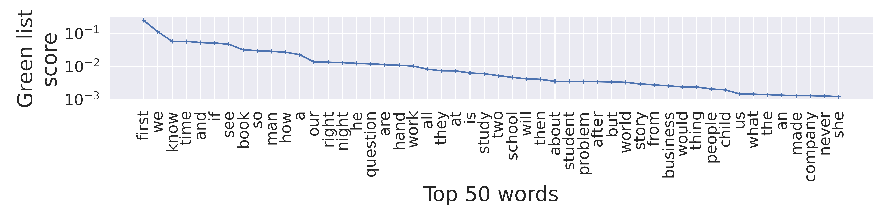

All hyperparameters are set in utils.parse_args()

Change args.TRANSFORMERS_CACHE to PATH where you want the models to be downloaded (somewhere in your scratch memory).
Change args.DUMP to PATH where you want the experiment outputs to be dumped.

Set "export TRANSFORMERS_CACHE="/PATH/TO/CACHE""

Task: Learn pair-wise occurance of tokens in watermarked texts. This helps in understading the gree list. Use this information to generate texts manually that are detected to be watermarked.

To run:

$ python get_matrix.py # stores the matrix in args.DUMP

$ python plot.py # generates green list score plot

$ python manual_generation.py # tool to ease human text generation using the generated matrix

Self-composed texts detected to be watermarked:

> Senseful sentence (Green list: 42.6\%, z-score: 4.36, Prediction: Watermarked):
the first thing you do will be the best thing you do. this is the reason why you do the first thing very well. if most of us did the first thing so well this world would be a lot better place. and it is a very well known fact.  people from every place know this fact. time will prove this point to the all of us. as you get more money you will also get this fact like other people do.  all of us should do the first thing very well. hence the first thing you do will be the best thing you do.

> Nonsense sentence (Green list: 92.5\%, z-score: 9.86, Prediction: Watermarked):
lot to and where is it about you know and where is it about you know and where is it that not this we are not him is it about you know and so for and go is it that.

Example plots:

Distribtion for prefix "the":

Distribtion for prefix "first":

Heatmap of green list scores for 20 words:
